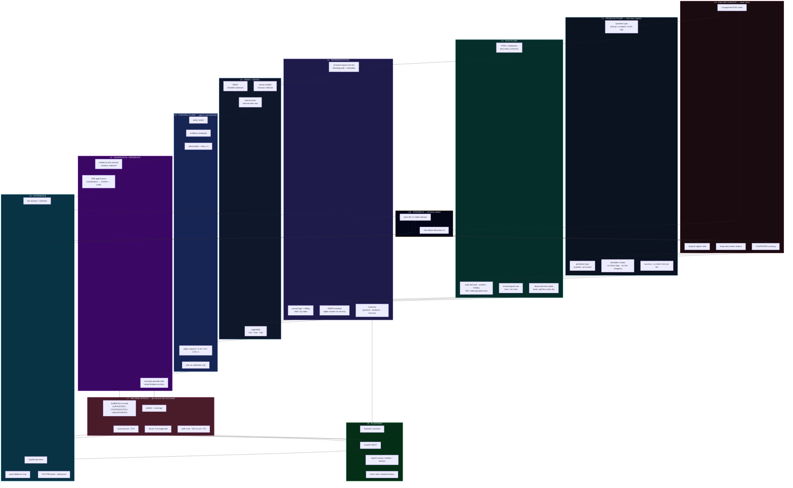
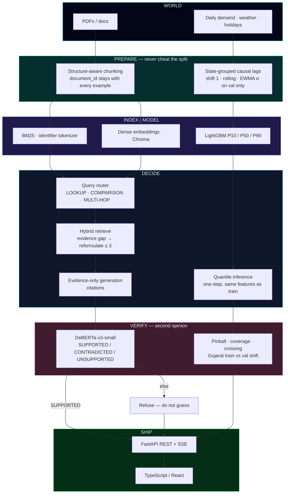

<div align="center">
  
</div>

<div align="center">

[](https://github.com/devcodes007)

</div>

<div align="center">

<a href="https://github.com/devcodes007"></a>
<a href="https://www.linkedin.com/in/devbrath-singh-gautam-50951029a/"></a>
<a href="mailto:devgautam030@gmail.com"></a>
<a href="https://docuverify-six.vercel.app"></a>
<a href="https://frontend-livid-seven-76.vercel.app"></a>

</div>

<br/>

```text
role        →  AI / ML intern
education   →  B.Tech ECE (IoT) · NSUT · 2027
now         →  DRDO · Scientific Analysis Group
loop        →  data → model → validate → FastAPI → TypeScript UI
```

I do not stop at a trained model. I design the system around it — retrieval, leakage checks, APIs, and a UI — so the miss is visible instead of hidden.

---

<div align="center">

## featured work

</div>

<table>
<tr>
<td width="50%" valign="top">

### [DocuVerify](https://github.com/devcodes007/Docuverify_2) — Agentic RAG

[](https://docuverify-six.vercel.app)
[](https://github.com/devcodes007/Docuverify_2)

Agent routes lookup / comparison / multi-hop, hybrid BM25 + dense retrieval, up to 3 retries. Fine-tuned **DeBERTa-v3-small** labels `SUPPORTED` / `CONTRADICTED` / `UNSUPPORTED` — a second model, not another LLM prompt. Unsupported answers are refused.

FastAPI backend (ingest, query, SSE traces) + TypeScript frontend.

`RAG` `FastAPI` `TypeScript` `ChromaDB` `DeBERTa` `BM25`

</td>
<td width="50%" valign="top">

### [State Demand Forecasting](https://github.com/devcodes007/State-Electricity-Demand-Forecasting-) — P10/P50/P90

[](https://frontend-livid-seven-76.vercel.app)
[](https://github.com/devcodes007/State-Electricity-Demand-Forecasting-)

LightGBM quantile regression for Delhi, Gujarat, Karnataka on 10k+ days. Leakage-safe lags, chronological splits, validation-only `α = 0.25` (P50 pinball **3.48**, **51.8%** coverage). Gujarat shift and ~12% crossing stay in the dashboard.

FastAPI backend + TypeScript / React client.

`Python` `LightGBM` `FastAPI` `TypeScript` `React` `Pandas`

</td>
</tr>
</table>

---

<div align="center">

## how I learn

</div>

I do not collect tutorials. I pick a failure I can measure, then force it through every layer of the stack until a UI can show the miss.



Eleven layers. Same loop as before — just the real machine behind it.

| layer | job |
| :--- | :--- |
| **L0 failure** | Name the miss: hallucination, leak, shift, crossing. |
| **L1 contract** | Question type, quantile type, cheats that are illegal. |
| **L2 data** | Document IDs and chronological cuts stay glued to every row. |
| **L3 representation** | Chunks + causal features + schemas. |
| **L4 index / model** | BM25 + dense hybrid, or LightGBM P10/P50/P90. |
| **L5 control** | Router, evidence retries, validation-only selection. |
| **L6 inference** | Evidence-only generation or one-step quantiles + SSE. |
| **L7 second opinion** | DeBERTa or pinball/coverage/crossing — then refuse. |
| **L8 platform** | FastAPI, Pydantic, real error paths. |
| **L9 UI** | TypeScript shows refuse / band / shift. |
| **L10 feedback** | Whatever the UI made obvious becomes the next L0. |

---

<div align="center">

## system architecture

how both products are the same machine

</div>



```text
DocuVerify path     docs → chunks → BM25+dense → agent → DeBERTa → FastAPI → TypeScript
Forecasting path    series → causal features → LightGBM quantiles → metrics → FastAPI → TypeScript
Shared rule         if the check fails, the UI shows the failure
```

---

<div align="center">

## stack I live in


</div>

<br/>

**languages** — Python · TypeScript · Java · SQL  
**ai / ml** — RAG · FastAPI · REST APIs · NLP · feature engineering · evaluation  
**libs** — PyTorch · Hugging Face · LightGBM · Scikit-learn · NumPy · Pandas  
**ship** — Git · Linux · Docker · AWS · Azure

---

<div align="center">

## contribution snake

the grid, eaten in order

<picture>
  <source media="(prefers-color-scheme: dark)" srcset="https://raw.githubusercontent.com/devcodes007/devcodes007/output/github-contribution-grid-snake-dark.svg" />
  
</picture>

</div>

---

<div align="center">


</div>

<div align="center">
  
</div>
